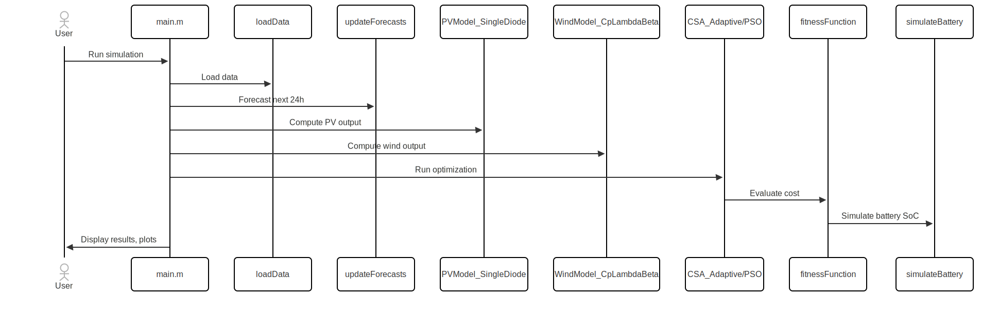
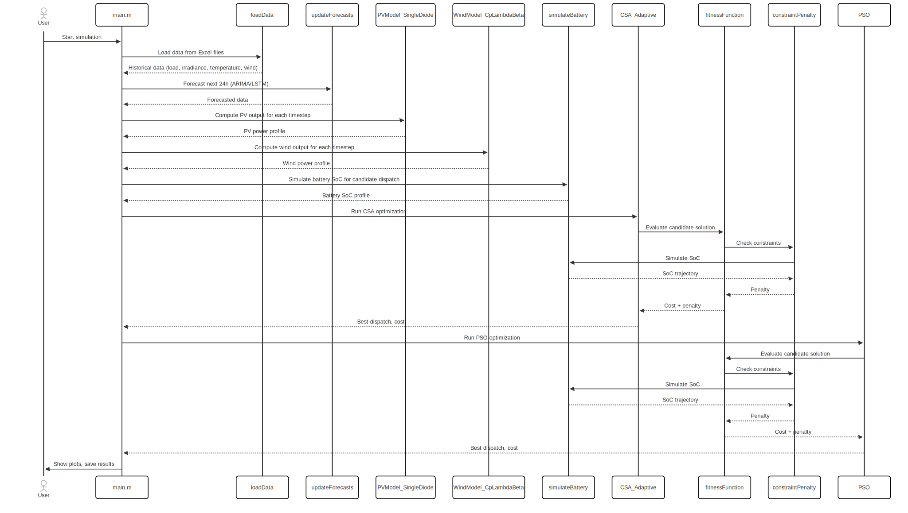
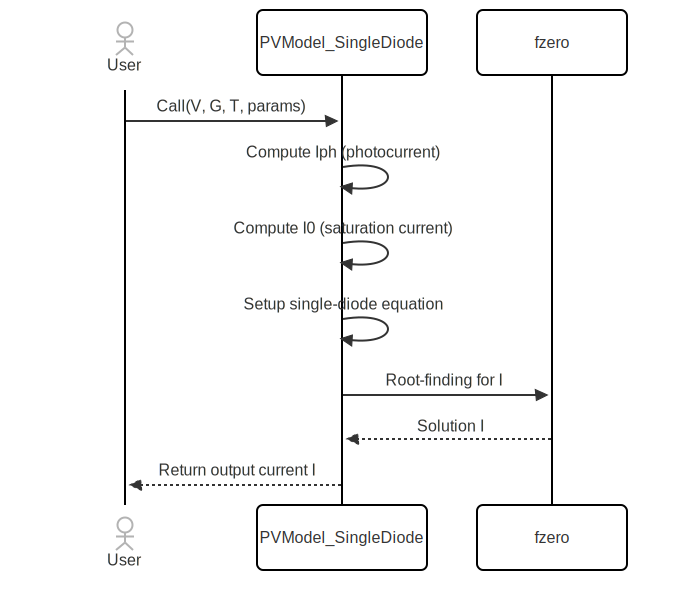
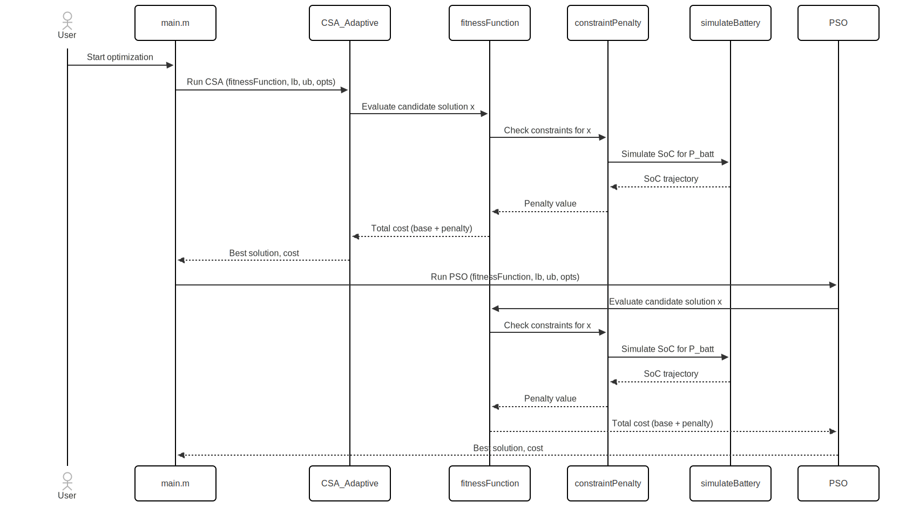

# MicrogridSim: MATLAB Microgrid Simulation & Optimization

## Description

**MicrogridSim** is a MATLAB project designed for simulating and optimizing hybrid microgrid operations, originally developed for a research report. It incorporates models for PV solar, wind turbines, battery storage, grid interaction, and diesel generators. The system uses advanced forecasting and metaheuristic optimization (Cuckoo Search Algorithm and Particle Swarm Optimization) to find optimal dispatch solutions. It's a practical example for those in research, engineering, or academia studying microgrids, renewable energy, and energy management.

---

## Table of Contents

1. [Features](#features)
2. [Architecture Overview](#architecture-overview)
3. [Installation / Setup](#installation--setup)
4. [Usage / Getting Started](#usage--getting-started)
5. [Configuration](#configuration)
6. [API Reference](#api-reference)
7. [Project Structure](#project-structure)
8. [Contributing](#contributing)
9. [License](#license)
10. [Sample Data](#sample-data)

---

## Features

- Data-driven forecasting (ARIMA and LSTM) for load, irradiance, temperature, and wind speed.
- Detailed PV (single-diode) and wind turbine models.
- Battery storage simulation with SoC tracking and efficiency.
- Metaheuristic optimization: Adaptive Cuckoo Search Algorithm (CSA) and Particle Swarm Optimization (PSO).
- Constraint enforcement for power balance, SoC, and operational limits.
- Visualization of forecasts and dispatch profiles.
- Results saving for further analysis.

---

## Architecture Overview

**Workflow:**

1. **System Parameter Setup**  
   Define PV, wind, battery, and cost parameters in `main.m`.

2. **Data Loading**  
   Load historical data from Excel files using the `loadData` function.

3. **Forecasting**  
   Forecast next 24 hours of load and renewables using ARIMA or LSTM (see `updateForecasts`).

4. **Renewable & Battery Simulation**  
   Compute PV and wind output using physical models; simulate battery SoC.

5. **Optimization**  
   Run CSA and PSO to minimize operational cost, subject to constraints.

6. **Results Visualization & Saving**  
   Plot dispatch profiles and save results.

---

### UML Diagram (PlantUML)

**Main Simulation and Optimization Flow**



---

## Installation / Setup

### Prerequisites

- MATLAB R2019b or later
- Toolboxes: Statistics and Machine Learning, Optimization, Deep Learning (for LSTM)
- Excel data files in `data/` directory:
  - `Atmospheric_Temperature.xlsx`
  - `1_LOAD_SCHEDULE.xlsx`
  - `accurate_my_wind_speed_and_solar_data.xlsx`

### Setup Steps

1. **Clone the repository**
   ```sh
   git clone https://github.com/al-chris/MicrogridSim.git
   cd MicrogridSim
   ```

2. **Place data files**
   - Ensure the required Excel files are in the `data/` directory.

3. **Open MATLAB and set the working directory**
   - Set to the project root.

4. **Add subfolders to MATLAB path**
   - This is done automatically at the start of `main.m`.

5. **Check toolbox availability**
   - Use `ver` in MATLAB to confirm required toolboxes.

**Troubleshooting:**
- Ensure data files are present and named correctly.
- Use a compatible MATLAB version with required toolboxes.

---

## Usage / Getting Started

1. **Run the main script**
   ```matlab
   main
   ```

2. **Select forecasting method**
   - In `main.m`, set:
     ```matlab
     forecastMethod = "arima";  % or "lstm"
     ```

3. **View results**
   - Plots for dispatch profiles will be shown.
   - Results are saved to `optimization_results.mat`.

---

## Configuration

- **System parameters:**  
  Set in `main.m` under "System parameters" (PV, wind, battery, cost, optimization).
- **Forecasting method:**  
  Set `forecastMethod` in `main.m`.
- **Data file paths:**  
  Hardcoded in `loadData` (inside `main.m`).

---

## API Reference

- **`loadData(params)`**  
  Loads and synchronizes historical data from Excel files.

- **`updateForecasts(data, history, method, nForecast)`**  
  Updates data with 24-hour forecasts using ARIMA or LSTM.

- **`PVModel_SingleDiode(V, G, T, params)`**  
  Computes PV current for given voltage, irradiance, temperature.

- **`WindModel_CpLambdaBeta(lambda, beta)`**  
  Calculates wind turbine power coefficient.

- **`CSA_Adaptive(fitnessFunc, lb, ub, opts)`**  
  Runs adaptive Cuckoo Search optimization.

- **`PSO(fitnessFunc, lb, ub, opts)`**  
  Runs Particle Swarm Optimization.

- **`fitnessFunction(x, data, params)`**  
  Calculates total operational cost and penalties.

- **`simulateBattery(P_batt, BESS_params)`**  
  Simulates battery SoC trajectory.

---

## Project Structure

```
MicrogridSim/
│
├── main.m                  # Main script and data loader
├── functions/              # Core models and optimization algorithms
├── forecasting/            # Forecasting modules
├── utils/                  # Utility scripts
├── tests/                  # Unit tests
├── data/                   # Input data (Excel files, not included)
└── optimization_results.mat # Output results (generated)
```

---

## Contributing

- Follow MATLAB coding standards (indentation, comments, function headers).
- Add unit tests for new modules in the `tests/` directory.
- Submit pull requests with clear descriptions.
- If modifying core algorithms, document changes thoroughly.

---

## License

[LICENSE](LICENSE)

---

## Sample Data

Below are example snippets from the required Excel input files:

### `accurate_my_wind_speed_and_solar_data.xlsx`
```
Date        Time      G      W_S
2/1/2023    1:00:43   0      12.74
2/1/2023    2:00:15   0      12.74
2/1/2023    3:00:33   0      12.74
2/1/2023    4:00:23   0      12.74
2/1/2023    5:00:59   0      12.74
2/1/2023    6:00:37   14     0.15
2/1/2023    7:00:23   12.25  0.03
2/1/2023    8:00:59   126    0.09
2/1/2023    9:00:37   255.5  0
```

### `1_LOAD_SCHEDULE.xlsx`
```
Date        Time      KW
2/1/2023    1:00:43   300
2/1/2023    2:00:15   294
2/1/2023    3:00:33   280
2/1/2023    4:00:23   272
2/1/2023    5:00:59   400
2/1/2023    6:00:37   460
2/1/2023    7:00:23   500
2/1/2023    8:00:59   580
2/1/2023    9:00:37   600
```

### `Atmospheric_Temperature.xlsx`
```
Date        Time      C
2/1/2023    1:00:43   35.2
2/1/2023    2:00:15   35.14
2/1/2023    3:00:33   35.27
2/1/2023    4:00:23   35.1
2/1/2023    5:00:59   35.1
2/1/2023    6:00:37   35.08
2/1/2023    7:00:23   34.79
2/1/2023    8:00:59   34.83
2/1/2023    9:00:37   34.63
```

---

## Visuals (Descriptions for Manual Creation)

1. **System Architecture Diagram:**  
   Show the flow from data input (Excel files) → forecasting → simulation (PV, wind, battery) → optimization (CSA/PSO) → results/plots.
   

2. **PV Model Flow:**  
   Visualize the process in `PVModel_SingleDiode.m`: Inputs (V, G, T, params) → Compute Iph/I0 → Root-finding for I → Output current.
   

3. **Optimization Process Flow:**  
   Diagram showing how CSA/PSO interact with the fitness function, constraint penalty, and battery simulation during optimization.
   

---
